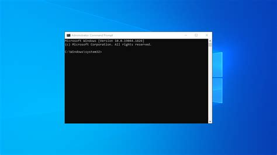
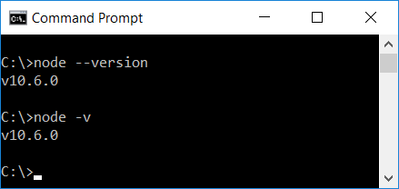

# 2024-IA22-2TRI
**(LEIA TUDINHO)**
Bom dia novato(a), vamos rodar uma aplicação hoje. Para agilizar, 
NÃO FECHE nenhuma janela/tarefa/aplicativo/terminal que eu lhe pedir para abrir, e dentro do VSCODE sempre salve as coisas com CTRL+S. **ARIGATO**🙏

### Vamos aprender:
- typescript
- node.js
- rodar um servidor
- criar uma aplicação
- e como rodar a aplicação no servidor

## 1° Oq é TypeScript
Ele é uma extensão **tipada** do JavaScript que compila para JavaScript puro. Da suporte a classes, módulos e interfaces.

## 2° Oq é Node, npm e Node.js
1. Node é uma plataforma que constroi aplicações de servidor
2. Node.js é o ambiente de execução 
3. npm é o gerenciador de pacotes para módulos do Node.js
> O Node.js é como seu celular Android, e o npm é a Play Store, onde você baixa e instala apps

## 3° Oq é "servidor"
Um servidor é um COMPUTADOR que vai ofertar um serviço ou aplicação.
> Como exemplo, o youtube, ele oferece o serviço de streaming e pra isso acontecer ele armazena os vídeos em ***MÁQUINAS SUPER-MEGA-FUDAS***👇


# ALGUNS PRÉ-REQUISITOS
1. Para executarmos o Node e programarmos em TypeScript vc prescisa ter ele no computador

    - No instituto, o Node já pode estar instalado. Para verificar, busque "cmd" no Windows. E procure por essa janela 👇 
    

    - Agora copie e cole esse código👇 na janela preta e aperte ENTER:
    ```
   node -v
   ```
   - Se estiver instalado deve aparecer algo como:
        

> Se vc estiver em um sistema ***LINUX***, busque pelo programa "terminal" e siga o mesmo passo-a-passo anterior
# CHEGOU A HORA DE PROGRAMAR 😈
1. Ainda no terminal anterior, crie uma pasta chamada "projeto" e entre nela com o comando abaixo👇:
```
mkdir projeto && cd projeto
```

2. Agora vamos iniciar o projeto e criar o arquivo de configuração. Fazemos isso com um comando:
```
npm init -y
```
3.  Vamos instalar alguns pacotes para rodarmos a nossa aplicação dentro de um servidor:
	- express [O servidor]
	- cors [politica que permite o compartilhamento de dados entre sites]
	- sqlite3 [driver que permite a conexão entre o Node e um banco de dados SQLite]
	- sqlite [um "facilitador", pra vc n escrever um código muito paia]

Para instalar, rode o comando abaixo
```typescript
npm install express cors sqlite3 sqlite
```
4. Vamos instalar mais pacotes, agora no MODO DESENVOLVEDOR (eles facilitam a nossa vida de programadores). Esses pacotes são:
- typescript [a linguagem]
- nodemon [um F5 automático para ajudar no desenvolvimento]
- ts-node [permite executar o typescript pelo node]
- @types/express [informações para o typescript entender como usar o express]
- @types/cors [informações para o typescript entender como usar o cors]

instale com esse comando:
```typescript
npm install --save-dev typescript nodemon ts-node @types/express @types/cors
```
5.  AGORA vamos criar um arquivo de configuração para o typescript, com o comando abaixo 👇
```typescript
npx tsc --init
```
6. Crie uma pasta chamada "src"👇
```typescript
mdkir src
```
7. Vamos abrir o VSCODE . **[n esqueça do pontinho]**👇
```typescript
code .
```
# AGORA VAMOS PROGRAMAR
Se tudo tiver ocorrido bem, vc vai ver algo assim:


1. Crie um arquivo dentro da pasta "src", e nomeie ele exatamente com esse nome: **app.ts**


2. Abra o arquivo tsconfig.json e APAGUE TODO O CÓDIGO
3. Copie esse código abaixo e cole dentro arquivo(tsconfig.json)
```json
{
  "compilerOptions": {
    "target": "ES2017",
    "module": "commonjs",
    "outDir": "./dist",
    "rootDir": "./src",
    "strict": true,
    "esModuleInterop": true,
    "skipLibCheck": true,
    "forceConsistentCasingInFileNames": true
  }
}
```
4. Abra o "package.json" e procure por um tal de "scripts" e adicione esse código dentro dele:
```json
"dev": "npx nodemon src/app.ts",
```
Deve ficar assim👇


5. Abra o "app.ts" que esta dentro da pasta "src" e cole esse código:
```typescript
import express from 'express';
import cors from 'cors';
import { connect } from './database';

const port = 3333;
const app = express();

app.use(cors());
app.use(express.json());

app.get('/', (req, res) => {
  res.send('Hello World');
});

app.post('/users', async (req, res) => {
    const db = await connect();
    const { name, email } = req.body;

    const result = await db.run('INSERT INTO users (name, email) VALUES (?, ?)', [name, email]);
    const user = await db.get('SELECT * FROM users WHERE id = ?', [result.lastID]);

    res.json(user);
});


app.listen(port, () => {
  console.log(`Server running on port ${port}`);
});

app.get('/users', async (req, res) => {
    const db = await connect();
    const users = await db.all('SELECT * FROM users');
  
    res.json(users);
});

app.put('/users/:id', async (req, res) => {
  const db = await connect();
  const { name, email } = req.body;
  const { id } = req.params;

  await db.run('UPDATE users SET name = ?, email = ? WHERE id = ?', [name, email, id]);
  const user = await db.get('SELECT * FROM users WHERE id = ?', [id]);

  res.json(user);
});

app.delete('/users/:id', async (req, res) => {
  const db = await connect();
  const { id } = req.params;

  await db.run('DELETE FROM users WHERE id = ?', [id]);

  res.json({ message: 'User deleted' });
});
```
# ESTA QUASE ACABANDOkkkk
1. Crie um arquivo chamado "database.ts" dentro da pasta "src" 👇
2. E cole esse lindo código dentro dele
```typescript
import { open } from 'sqlite';
import sqlite3 from 'sqlite3';

let instance: any | null = null;

export async function connect() {
  if (instance) return instance;

  const db = await open({
     filename: './src/database.sqlite',
     driver: sqlite3.Database
   });
  
  await db.exec(`
    CREATE TABLE IF NOT EXISTS users (
      id INTEGER PRIMARY KEY AUTOINCREMENT,
      name TEXT,
      email TEXT
    )
  `);

  instance = db;
  return db;
}
```
3. Crie um arquivo dentro da pasta src chamado "test.http"
4. E por final, instale uma extensão no seu VSCODE chamada "REST Client" 👇
---
# Agora vamos rodar e testar o nosso servidor
1. Naquele terminal bem antigo nosso. Cole e rode esse comando:
```sh
npm run dev
```
2. Abra o Chrome ou Firefox, e cole na barra de pesquisa esse link:
```sh
http://localhost:3333/
```
3. É provavel que vc veja uma tela branca e bem no cantinho superior esquerdo duas palavras: "Hello Word", isso significa que está rodando corretamente o servidor.
4. Agora vamos testar algumas funções do nosso servidor, que são as de : adicionar um úsuario, atualizar as informações dele e apagalo da face da terra.
5. lembra do arquivo "test.http"? Pois então, ele vai ser o nosso carteiro. Ele que vai mandar as mensagens para o nosso servidor.
6. Abra ele e cole esse código:
```http
POST http://localhost:3333/users HTTP/1.1
content-type: application/json

{
  "name": "John Doe",
  "email": "johndoe@mail.com"
}

####

PUT http://localhost:3333/users/1 HTTP/1.1
content-type: application/json

{
  "name": "John Doe Updated",
  "email": "johndoe@mail.com"
}

####

DELETE http://localhost:3333/users/1 HTTP/1.1
```
7. Se vc prestar atenção, em cima do POST, PUT e DELETE, temos duas palavrinhas "Send Request". Elas não estão ali por acaso. Elas só aparecem se vc tiver instalado aquela extensão que eu falei.

## Vamos testar em partes agora
- Primeiro clique no "Send Request" que está acima do POST.
- Após ter feito isso, vc disse pro servidor: "mano, existe uma cara chamado "John Doe" e o email dele é "johndoe@mail.com"
- Verifique se foi enviado ou não essa mensagem, acessando esse link:
```http
http://localhost:3333/users
```
- Agora clique no "Send Request" que está acima do "PUT"
- Após ter feito isso, vc disse pro servidor: "mano, lembra daquele cara "Jonh Doe"? É.... eu me confundi, ele n se chama assim, o nome dele real é John Doe Updated, bizzano né 😳"
- Verifique se mudou o nome dele:
```http
http://localhost:3333/users
```
- Por fim, clique no ultimo "Send Request", que está acima do DELETE
- Apóst ter feito isso, vc disse pro servidor: "mano, o Jonh, ele foi de vasco, bateu as botas, foi de americanas. DELETE-O do banco de dados.
- Verifique se existe se ele já n existe mais:
```http
http://localhost:3333/users
```
