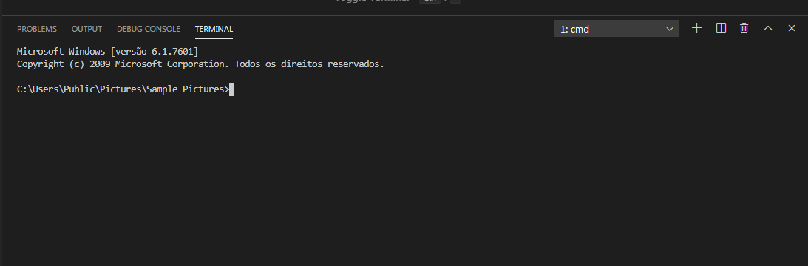

# 2024-IA22-2TRI
Bom dia criançada (leia, se não vc sera reprovado na disciplina)

Obs: A partir de agora, pare tudo(joguinhos, conversinhas e desinstale o insta e tiktok)

### Vamos aprender:
- typescript
- node.js
- rodar um servidor
- criar uma aplicação
- e como rodar a aplicação no servidor

> Voce deve estar se perguntando "o que são essas coisas?". Então continue lendo para entender...

## 1° TypeScript
O TypeScript is a typed superset of **JavaScript** that compiles to plain JavaScript. It offers classes, modules, and interfaces to help you build robust components. (Uma extensão ou um "plus" do Javascript)

## 2° Node.js
O Node is a platform for building fast and scalable server applications using JavaScript(É a base pra rodar um app no servidor). Node.js is the runtime and npm is the Package Manager for Node.js modules.(Exemplo: o node é o seu celular android, e o npm é a play store, aonde vc baixa e instala apps...)

## 3° Servidor e aplicação
Um servidor nada mais é que uma máquina que vai ofertar para algumas ou várias pessoas um serviço ou aplicação. Como exemplo, o youtube, ele oferece o serviço de streaming(assistir vídeos) e pra isso acontecer ele armazena os vídeos em ***MÁQUINAS SUPER-MEGA-FUDAS***:


# ALGUNS PRÉ-REQUISITOS
1. Para executarmos o Node e escrevermos códigos legais em TypeScript, vc prescisa instalar o node (óbvio)
    - Se vc esta no instituto, talvez já esteja instalado no pc. Para verificar se está, pesquise na barra de busca do Windows por "cmd". Sera aberta uma janela preta. Tipo essa 👇
    
    - Agora copie e cole esse código na janela preta:
        ```
        node --version
        ```
        E aperte a tecla Enter no teclado. Se estiver instalado deve aparecer algo como:
        
        
    - Se por obséquio vc estiver em um sistema ***LINUX***, vc deve buscar pelo programa "terminal", e seguir o mesmo passo-a-passo anterior (apartir do copiar e colar código)
    
    - Mas se ***NÃO ESTIVER*** instalado, ai ferrou, vc tera que baixar e instalar. Segue o link: https://nodejs.org/en e clique em "Download". Após isso apenas clique no botão "Next" na janela do instalador. No ***LINUX*** do instituo vc n vai conseguir fazer a proeza de instalar. Porém se vc estiver na sua casa, instale com o comando: ```sudo apt install nodejs -y```
---
# CHEGOU A HORA DE HACKEAR A PROGRAMAÇÃO 😈

1. Crie uma pasta com este nome: projeto
2. Abra o Visual Studio Code
3. Abra a pasta que vc criou antes por dentro do Visual Studio Code
4. Aperta essas duas teclas juntas (Ctrl + '):

5. Sera aberta uma caixa muito semelhante ao terminal que já vimos anteriormente:


# AGORA VAMOS DIGITAR COISAS NO TERMINAL 

***PRIMEIRAMENTE*** vamos iniciar o projeto e criar o arquivo de configuração. Fazemos isso tudo com apenas um comando:
```typescript
npm init -y
```
---
***SEGUNDAMENTE*** vamos instalar alguns pacotes para rodarmos a nossa aplicação dentro de um servidor, sendo elas:
- express [framework que vai dar uma ajudada pra criar a nossa aplicação]
- cors [habilita uma politica no servidor express, que permite diferentes sites compartilhem informações com o seu (óbvio)]
- sqlite3 [driver que permite a conexão/operações entre o Node e um banco de dados SQLite]
- sqlite [é um "facilitador" do driver acima, pra vc n escrever um código muito paia]

fazemos a instalação com esse código:
```typescript
npm install express cors sqlite3 sqlite
```
---
***TERCEIRAMENTE*** vamos instalar mais pacotes, porem com um diferencial, agora estamos instalando coisas no MODO DESENVOLVEDOR(pois esses pacotes só tem sentido para nós programadores e facilitam a nossa vida). Essas pacotes são:
- typescript [a linguagem supertipada que vamos usar]
- nodemon [um F5 automático para ajudar no nosso desenvolvimento]
- ts-node [permite executar o typescript pelo node]
- @types/express [informações para o typescript entender como usar o express]
- @types/cors [informações para o typescript entender como usar o cors]

instale com esse comando:
```typescript
npm install --save-dev typescript nodemon ts-node @types/express @types/cors
```
---
***QUARTAFEIRAMENTE*** vamos criar um arquivo de configuração para o typescript definir como o compilador vai tranformar o código feito em TYPESCRIPT em Javascript. Digite:
```typescript
npx tsc --init
```
---
***QUINTAFEIRAMENTE*** vamos criar uma pasta dentro da sua pasta chamada "projeto", vamos chamalha de "src", para isso digite:
```sh
mdkir src
```
---
***SEXTAMENTE*** vamos criar o arquivo principal do nosso projeto. Se vc estiver no Windows, digite:
```powershell
powershell New-Item -Path ".\scr\app.ts" -ItemType "file"
```
Se estivor no ***LINUX***:
```bash
touch src/app.ts
```
---
# AGORA VAMOS CODAR
Abra o tsconfig.json, de um Ctrl + A, e aperte a tecla Del do seu teclado. E copie esse codigo inteiro e cole dentro:
```json
{
  "compilerOptions": {
    "target": "ES2017",
    "module": "commonjs",
    "outDir": "./dist",
    "rootDir": "./src",
    "strict": true,
    "esModuleInterop": true,
    "skipLibCheck": true,
    "forceConsistentCasingInFileNames": true
  }
}
```
---
Abra o package.json e adicione esse código:
```json
"dev": "npx nodemon src/app.ts"
```
dentro do bloco "scripts", deve ficar parecido com isso:
```json
"scripts": {
  "dev": "npx nodemon src/app.ts"
}
```
----
Agora vc vai dentro da pasta "src" e vai colar esse código no arquivo app.ts:
```typescript
import express from 'express';
import cors from 'cors';

const port = 3333;
const app = express();

app.use(cors());
app.use(express.json());

app.get('/', (req, res) => {
  res.send('Hello World');
});

app.listen(port, () => {
  console.log(`Server running on port ${port}`);
});
```
## AGORA VAMOS RODAR O SERVIDOR
Se vc fechou o terminal abra outra vez, e digite:
```sh
npm run dev
```
