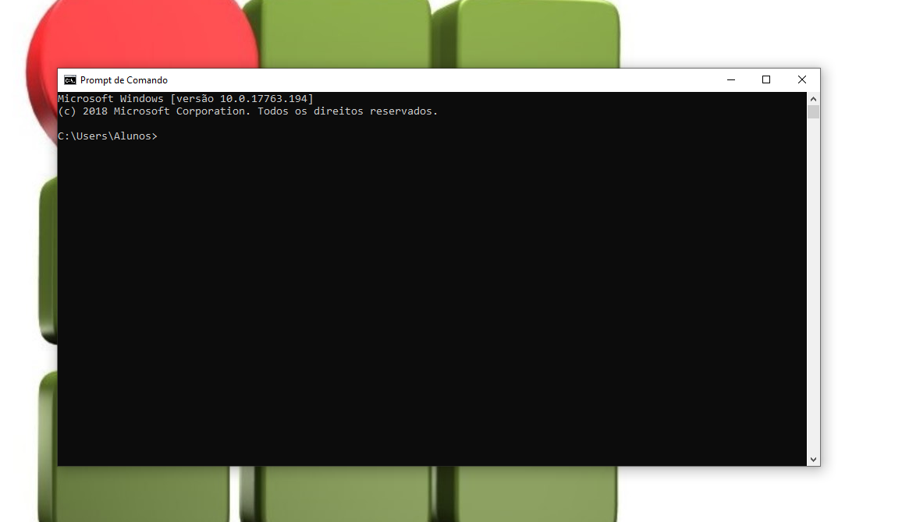
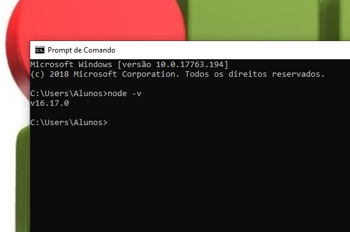
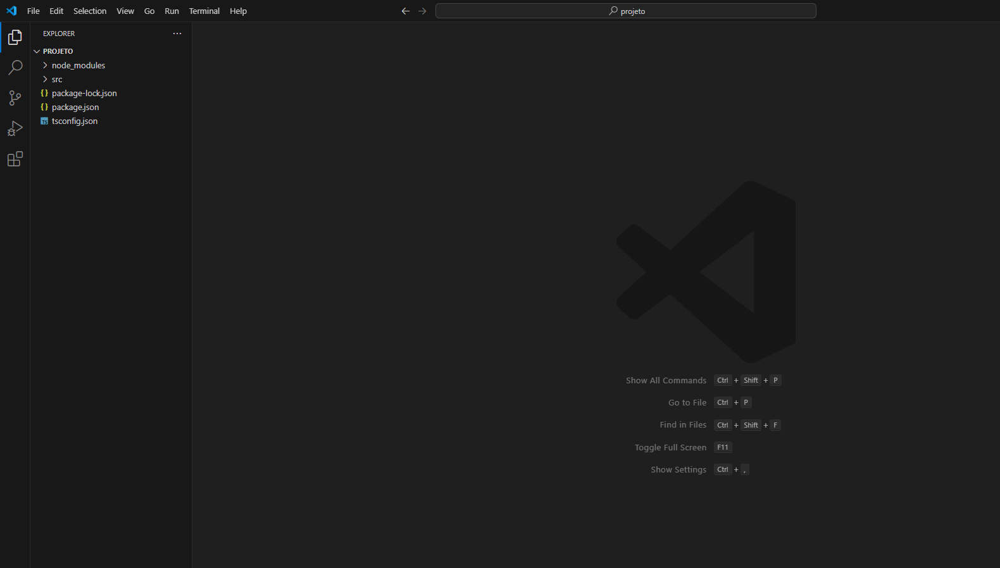
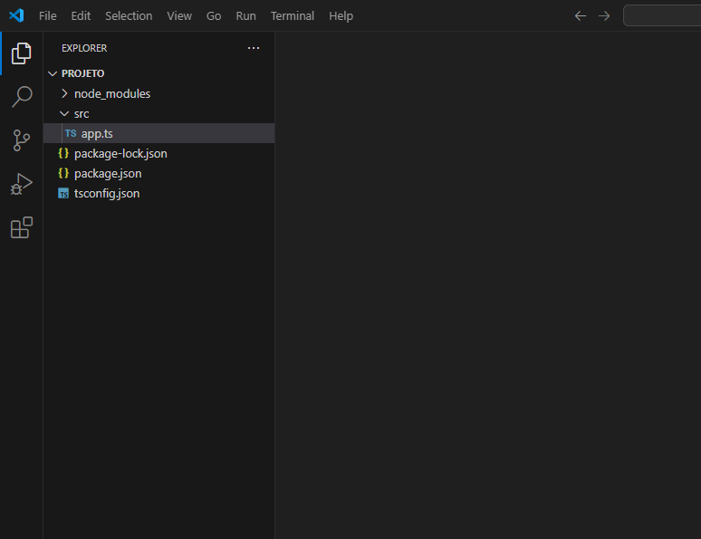
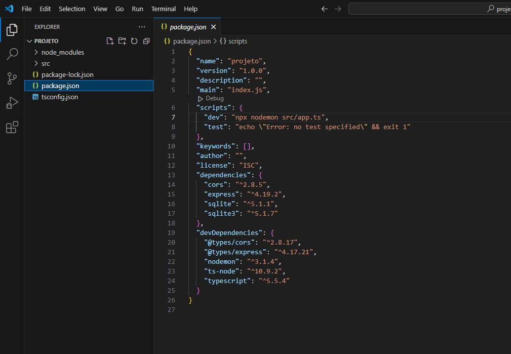
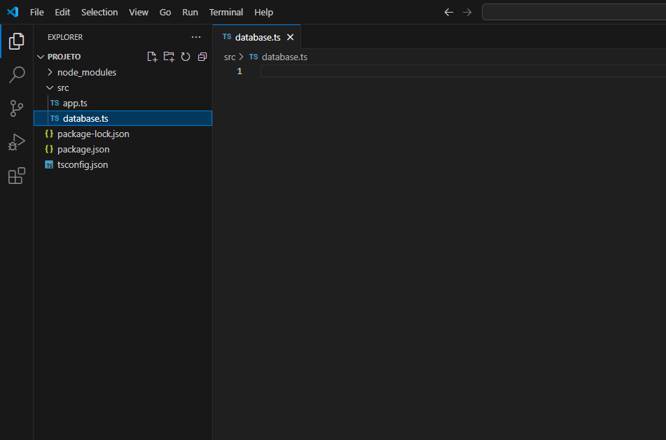
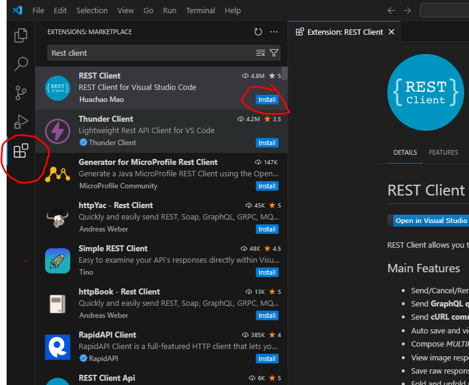
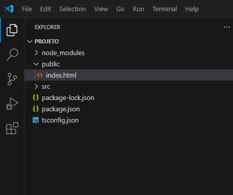

# 2024-IA22-2TRI
Bom dia novato(a), vamos fazer um projetinho.

Se você quer agilizar e terminar rápido:
- **NÃO FECHE NENHUMA JANELA** que você abrir.
- No VSCODE sempre que editar algo, salve a edição com CTRL+S

# ALGUNS PRÉ-REQUISITOS
1. Antes de começar o projeto verifique se o programa Node está instalado.
    1. Busque pelo programa "cmd" no Windows. Vai ser aberta essa janela👇 
    
    2. **NUNCA FECHE ESSA JANELA, TIPO NUNCA** (se n, n vai funcionar)
    3. Agora copie e cole esse código abaixo👇 e aperte ENTER:
    ```sh
    node -v
    ```
    4. Deve aparecer a versão do node, talvez n seja igual como esta na imagem, mas n importa:
    

> Se vc estiver em um sistema ***LINUX***, busque pelo programa "terminal" e siga o mesmo passo-a-passo anterior

2. Ainda no terminal anterior, com o comando abaixo👇, vamos criar uma pasta e entrar nela:
```sh
mkdir projeto && cd projeto
```
3. Agora vamos iniciar o projeto e criar o arquivo de configuração
```
npm init -y
```
4. Abaixo temos alguns pacotes que prescimos para rodar o projeto
  - express [O servidor]
  - cors [politica que permite o compartilhamento de dados entre sites]
  - sqlite3 [driver que permite a conexão entre o Node e um banco de dados SQLite]
  - sqlite [um "facilitador", pra vc n escrever um código muito paia]

Para instalar os pacotes acima, rode o comando abaixo:
```sh
npm install express cors sqlite3 sqlite
```
5. Vamos instalar mais pacotes, agora no MODO DESENVOLVEDOR (eles facilitam a nossa vida de programadores). Esses pacotes são:
   - typescript [a linguagem que vamos usar]
   - nodemon [um F5 automático para ajudar no desenvolvimento]
   - ts-node [permite executar o typescript pelo node]
   - @types/express [informações para o typescript entender como usar o express]
   - @types/cors [informações para o typescript entender como usar o cors]

Instale os pacotes👇
```typescript
npm install --save-dev typescript nodemon ts-node @types/express @types/cors
```
6.  Crie o arquivo de configuração para o typescript
```typescript
npx tsc --init
```
6. Crie uma pasta chamada `src`
```typescript
mkdir src
```
7. O comando abaixo vai abrir o vscode, vai demorar um pouco pra abrir. Espere.
```typescript
code .
```
# HORA DE COMEÇARMOS O PROJETO
Se tudo tiver ocorrido bem, vc vai ver o vscode exatamente assim:


1. Crie um arquivo dentro da pasta "src" e nomeie ele exatamente com esse nome: `app.ts`


2. Abra o arquivo tsconfig.json(de dois clique nele) e APAGUE TODO O CÓDIGO. (CTRL+A e DELETE)
3. Copie esse código abaixo e cole dentro arquivo `tsconfig.json`
```json
{
  "compilerOptions": {
    "target": "ES2017",
    "module": "commonjs",
    "outDir": "./dist",
    "rootDir": "./src",
    "strict": true,
    "esModuleInterop": true,
    "skipLibCheck": true,
    "forceConsistentCasingInFileNames": true
  }
}
```
4. Abra o arquivo `package.json` e procure por um tal de "scripts" e adicione esse código
```json
"dev": "npx nodemon src/app.ts",
```
Deve ficar assim👇 OBS: Salve as mudanças com CTRL+S


5. Crie um arquivo chamado "database.ts" dentro da pasta "src" 👇


6. E cole esse código:
```typescript
import { open } from 'sqlite';
import sqlite3 from 'sqlite3';

let instance: any | null = null;

export async function connect() {
  if (instance) return instance;

  const db = await open({
     filename: './src/database.sqlite',
     driver: sqlite3.Database
   });
  
  await db.exec(`
    CREATE TABLE IF NOT EXISTS users (
      id INTEGER PRIMARY KEY AUTOINCREMENT,
      name TEXT,
      email TEXT
    )
  `);

  instance = db;
  return db;
}
```

7. Abra o `app.ts` que vc criou dentro da pasta "src" e cole o código abaixo👇
```typescript
import express from 'express';
import cors from 'cors';
import { connect } from './database';

const port = 1111;
const app = express();

app.use(cors());
app.use(express.json());
app.use(express.static(__dirname + '/../public'))

app.get('/', (req, res) => {
  res.send('Hello World');
});

app.post('/users', async (req, res) => {
    const db = await connect();
    const { name, email } = req.body;

    const result = await db.run('INSERT INTO users (name, email) VALUES (?, ?)', [name, email]);
    const user = await db.get('SELECT * FROM users WHERE id = ?', [result.lastID]);

    res.json(user);
});


app.listen(port, () => {
  console.log(`Server running on port ${port}`);
});

app.get('/users', async (req, res) => {
    const db = await connect();
    const users = await db.all('SELECT * FROM users');
  
    res.json(users);
});

app.put('/users/:id', async (req, res) => {
  const db = await connect();
  const { name, email } = req.body;
  const { id } = req.params;

  await db.run('UPDATE users SET name = ?, email = ? WHERE id = ?', [name, email, id]);
  const user = await db.get('SELECT * FROM users WHERE id = ?', [id]);

  res.json(user);
});

app.delete('/users/:id', async (req, res) => {
  const db = await connect();
  const { id } = req.params;

  await db.run('DELETE FROM users WHERE id = ?', [id]);

  res.json({ message: 'User deleted' });
});
```
# ESTÁ PERTO DO FIM...
1. Crie um arquivo dentro da pasta "src" chamado `test.http`
2. E instale uma extensão no seu VSCODE chamada "REST Client". Tutorial fodão abaixo👇

---
# Agora vamos rodar e testar o nosso servidor
1. Naquele terminal que vc n fechou. Cole e rode esse comando:
```sh
npm run dev
```
> Se vc fechou, ainda há esperanças. Clique nessas teclas: CTRL+'  [esse **'** é uma tecla q está abaixo do ESC ] E rode o comando anterior na caixa preta que abrir.
2. Agora abra o Chrome ou Firefox e cole na barra de pesquisa esse link:
```sh
http://localhost:1111/
```
3. Vc vai ver uma tela branca e bem no cantinho superior duas palavras: "Hello Word"
4. Agora vamos testar algumas funções do nosso servidor, que são as de:
   - adicionar um úsuario
   - atualizar as informações dele
   - e apagalo
6. Abra o test.http (está dentro da pasta src) e cole esse código
```http
POST http://localhost:1111/users HTTP/1.1
content-type: application/json

{
  "name": "John Doe",
  "email": "johndoe@mail.com"
}

####

PUT http://localhost:1111/users/1 HTTP/1.1
content-type: application/json

{
  "name": "John Doe Updated",
  "email": "johndoe@mail.com"
}

####

DELETE http://localhost:1111/users/1 HTTP/1.1
```
7. Se vc prestar atenção, em cima do POST, PUT e DELETE, temos duas palavrinhas "Send Request". Elas não estão ali por acaso. Elas só aparecem se vc tiver instalado aquela extensão que eu falei(REST Client)

## Vamos testar agora
1. Clique no "Send Request" que está acima do `POST`
2. Vc acabou de dizer pro servidor: "mano, existe uma cara chamado "John Doe" e o email dele é "johndoe@mail.com"
3. Verifique se foi enviado ou não essa mensagem, acessando esse link:
```sh
http://localhost:1111/users
```
4. Clique no "Send Request" que está acima do `PUT`
- Vc acabou de dizer pro servidor: "mano, lembra daquele cara "Jonh Doe"? É.... eu me confundi, ele n se chama assim, o nome dele real é John Doe Updated, bizzano né😳"
- Verifique se mudou o nome dele [atualize á pagina]:
```sh
http://localhost:1111/users
```
- Por fim, clique no ultimo "Send Request", que está acima do `DELETE`
- Após ter feito isso, vc disse pro servidor: "mano, o Jonh, ele foi de vasco, bateu as botas, foi de americanas. DELETE ele do banco de dados.
- Verifique se ele já n existe mais [atualize á pagina]:
```sh
http://localhost:3333/users
```

## Agora vamos adicionar o FrontEnd
1. Crie uma pasta chamada: `public` pelo vscode ou com o comando abaixo:
```sh
mkdir public
```
3. E crie um arquivo html chamado "index.html" dentro da pasta public. Deve ficar assim 👇
.
4. E cole esse código 👇
```html
<!DOCTYPE html>
<html lang="en">
<head>
  <meta charset="UTF-8">
  <meta name="viewport" content="width=device-width, initial-scale=1.0">
  <title>Document</title>
</head>

<body>
  <form>
    <input type="text" required name="name" placeholder="Nome">
    <input type="email" required name="email" placeholder="Email">
    <button type="submit">Cadastrar</button>
  </form>
  <table>
    <thead>
      <tr>
        <th>Id</th>
        <th>Name</th>
        <th>Email</th>
        <th>Ações</th>
      </tr>
    </thead>
    <tbody>
      <!--  -->
    </tbody>
  </table>
  <script>
    const form = document.querySelector('form')
    form.addEventListener('submit', async (event) => {
      event.preventDefault()
      const name = form.name.value
      const email = form.email.value
      await fetch('/users', {
        method: 'POST',
        headers: { 'Content-Type': 'application/json' },
        body: JSON.stringify({ name, email })
      })
      form.reset()
      fetchData()
    })
    const tbody = document.querySelector('tbody')
    async function fetchData() {
      const resp = await fetch('/users')
      const data = await resp.json()
      tbody.innerHTML = ''
      data.forEach(user => {
        const tr = document.createElement('tr')
        tr.innerHTML = `
          <td>${user.id}</td>
          <td>${user.name}</td>
          <td>${user.email}</td>
          <td>
            <button class="excluir">excluir</button>
            <button class="editar">editar</button>
          </td>
        `
        const btExcluir = tr.querySelector('button.excluir')
        const btEditar = tr.querySelector('button.editar')
        btExcluir.addEventListener('click', async () => {
          await fetch(`/users/${user.id}`, { method: 'DELETE' })
          tr.remove()
        })
        btEditar.addEventListener('click', async () => {
          const name = prompt('Novo nome:', user.name)
          const email = prompt('Novo email:', user.email)
          await fetch(`/users/${user.id}`, {
            method: 'PUT',
            headers: { 'Content-Type': 'application/json' },
            body: JSON.stringify({ name, email })
          })
          fetchData()
        })
        tbody.appendChild(tr)
      })
    }
    fetchData()
  </script>
</body>
</html>
```
5. **E FINALMENTE** Acesse esse link: `http://localhost:1111/users`. E teste os botões, adicione pessoas e removas elas. 😊
